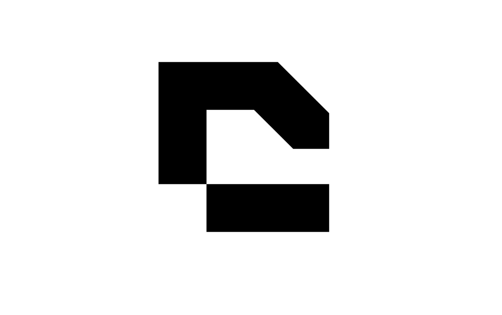

<div align="center">
  
  <h1>Canvas2Code <sup style="font-size: 12px; font-weight: 400; opacity: 0.6;">BETA</sup></h1>
  <p><strong>Design together. Code together. Ship together.</strong></p>
  <p>A real-time collaborative workspace that bridges the gap between design and engineering.</p>
  
  > [!IMPORTANT]
  > **Beta Build Notice**: This project is currently in Beta. You may encounter minor synchronization inconsistencies or performance variations as we optimize the real-time engine.

  <p>
    <a href="https://canvastocode.vercel.app/" target="_blank">
      
    </a>
    &nbsp;
    
    &nbsp;
    
    &nbsp;
    
  </p>
</div>

---

## What is Canvas2Code?

Canvas2Code is a high-performance, real-time collaborative platform built for modern engineering teams. It gives every team member a single shared space — an infinite whiteboard, a full cloud IDE, and a live video call — all running simultaneously in the browser with no installation required.

---

## Features

### Infinite Canvas
- Freehand drawing, shapes, arrows, sticky notes, and text
- Pan and zoom with no resolution loss
- Real-time sync — see every stroke from teammates instantly
- Undo / redo history shared across the session

### Collaborative Code Editor
- Powered by **Monaco Editor** (the engine behind VS Code)
- Syntax highlighting for TypeScript, JavaScript, Python, Java, C#, PHP, HTML, CSS
- Live code execution via the **Piston API** — run code directly in the browser
- Real-time sync — every keystroke shared with 300ms debounce

### Built-in Video Call
- Native WebRTC via **PeerJS** — no third-party service
- Floats above the workspace without interrupting flow
- Falls back gracefully to audio-only if no camera is detected

### Instant Rooms
- No signup required — create or join a room with a single code
- Room state persists for the entire session
- Share your room link in one click

---

## Tech Stack

| Layer | Technology |
|---|---|
| **Frontend** | Next.js 16, TypeScript, Framer Motion, GSAP |
| **Canvas** | Konva.js / React-Konva |
| **Editor** | Monaco Editor |
| **Realtime** | Socket.io (client + server) |
| **3D Scene** | Spline (`@splinetool/react-spline`) |
| **Backend** | Node.js, Express, Socket.io |
| **Code Execution** | Piston API |
| **Video** | PeerJS (WebRTC) |
| **Backend Hosting** | Hugging Face Docker Space |
| **Frontend Hosting** | Vercel |

---

## Getting Started

### Prerequisites
- Node.js v18+

### Clone & Install

```bash
git clone https://github.com/adityaverma9777/CanvasandCode.git
cd CanvasandCode
```

**Install frontend dependencies:**
```bash
cd client
npm install
```

**Install backend dependencies:**
```bash
cd ../server
npm install
```

### Environment Variables

Create `client/.env.local` (copy from `client/.env.example`):

```env
NEXT_PUBLIC_SOCKET_URL=https://edyxapi-canvas2code.hf.space
GROQ_API_KEY=your_groq_api_key_here
HF_API_TOKEN=your_hf_api_token_here
```

### Run Locally

**Start the backend:**
```bash
cd server
npm start
```

**Start the frontend:**
```bash
cd client
npm run dev
```

Frontend: http://localhost:3000  
Backend: http://localhost:3001

---

## Deployment

| Service | Purpose | URL |
|---|---|---|
| **Vercel** | Frontend (Next.js) | [canvastocode.vercel.app](https://canvastocode.vercel.app/) |
| **Hugging Face Spaces** | Backend (Socket.io) | [edyxapi-canvas2code.hf.space](https://edyxapi-canvas2code.hf.space) |

---

## License

Distributed under the MIT License.

---

<div align="center">
  <p>Built by <strong>Aditya Verma</strong></p>
  <a href="https://canvastocode.vercel.app/">canvastocode.vercel.app</a>
</div>